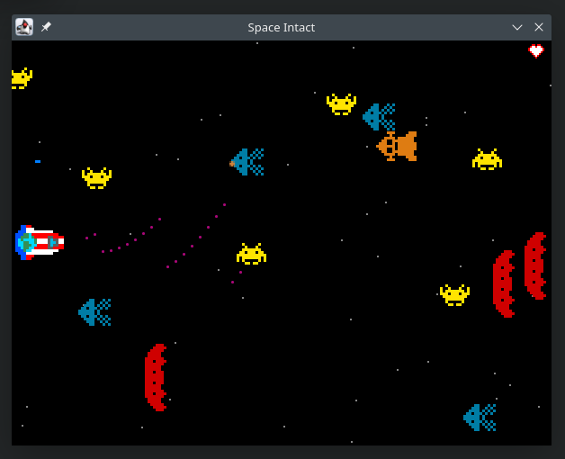

# Space Intact

A simple space shooter game inspired by Space Impact, in which all enemy aliens must be exterminated. Created as a FIT CTU school project.

Currently includes (only) 4 levels, each introducing a new weapon and a new enemy type.

## Screenshot

## How to run

1. Clone the repository, `cd` into it
2. Build the Maven project: `mvn package`
3. Run the game using `mvn exec:java`, or by directly executing the built JAR using `java -jar <PATH_TO_JAR>`
